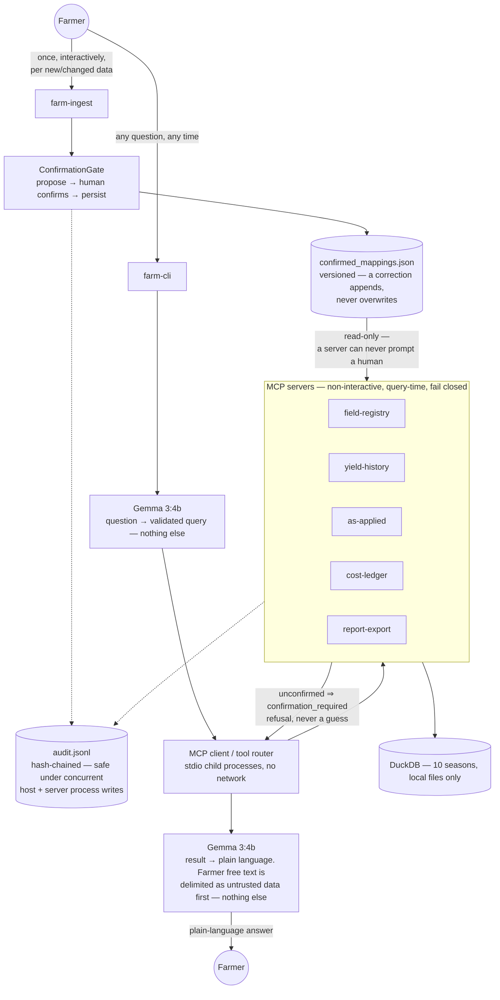

# Precision Farm MCP

A local-first, offline decision-support tool for one farmer's laptop. Ask a
plain-English question about your own farm's ten-season record — costs,
yields, profit — and get back an answer grounded entirely in your own
files, never a prediction or a guess.


Under the hood, a small local model (Gemma 3B via Ollama) only ever turns
the question into a structured lookup and turns the computed answer into
plain language — it never touches the data or the arithmetic. Everything
else (field identity across years of renames/splits/merges, cost-ledger
ingestion, yield reconciliation, profitability) is deterministic Python,
checked against a synthetic ground-truth dataset, using an MCP (Model
Context Protocol) architecture adapted from
[precision-medicine-mcp](https://github.com/lynnlangit/precision-medicine-mcp).

**v1 is retrospective arithmetic only.** No yield prediction, no crop
simulation, no prescriptive recommendations, no remote sensing. Those are
later phases; building toward them now would be speculative structure.

## Architecture



Gemma touches a question at exactly two points — parsing it into a
validated query, and narrating a computed result. It never sees raw data,
computes a number, or resolves an ambiguous name itself; the model layer
can't import a database or MCP client (`model/tests/test_model_bounded.py`).

Confirmation is structural. A server can't prompt a human, so `farm-ingest`
confirms and persists every alias, event, and mapping once, with a human
present; servers read that record, refusing (`confirmation_required`)
rather than guessing. Every decision lands in one hash-chained,
concurrency-safe audit log. Ledger notes reaching Gemma are delimited as
untrusted, excluded from grounding, and never followed as instructions —
proven against an injected-prompt defect.

## Quick start

```bash
# Generate ten seasons of synthetic (deliberately messy) farm data
uv run --project generator python -m farm_data_gen.cli --seed 42 --out data/synthetic

# Confirm every naming-drift alias, identity event, and column mapping once,
# interactively -- MCP servers are non-interactive stdio processes and can
# never do this themselves, so every query refuses until this has run.
uv run --project host farm-ingest

# Ask a question (requires a local Ollama with gemma3:4b pulled)
ollama pull gemma3:4b
uv run --project host farm-cli "was the north eighty a bad field or a bad year"
```

## Repository layout

| Path | What it is |
|---|---|
| `generator/` | Deterministic synthetic-data generator: 10 seasons, ~12 fields, every defect (naming drift, splits/merges, sensor calibration error, messy spreadsheets) deliberately injected and recorded in `ground_truth.json` |
| `core/` (`farm_core`) | Shared library: DuckDB ingestion, field-identity resolution, reconciliation, the profitability engine, audit log, governance |
| `servers/mcp-*` | Five FastMCP servers exposing `farm_core` as MCP tools (Pydantic I/O, `readOnlyHint`, structured refusals, a `modeled` field reserved for future model output) |
| `host/` (`farm_host`) | The host application: MCP client/router (stdio, untrusted-text sanitization), `farm-ingest` (human-present confirmation) and `farm-cli` (query, fails closed) |
| `model/` (`farm_model`) | The bounded Gemma layer: question → query, result → narration, plus the verification that keeps it bounded |
| `docs/EVAL_QUESTIONS.md` | Ten independent evaluation questions, each verifiable against `ground_truth.json` |

## The three hard problems

1. **Field identity across ten years.** A field's name isn't a stable key —
   it drifts in the farmer's own spreadsheet, gets formally renamed, and
   stops meaning anything across a split or merge. `core/field_identity.py`
   resolves the real ten-year timeline from raw files alone, using acreage
   continuity (not string matching) as the signal — proven first, since
   it's the riskiest piece.
2. **Spreadsheet ingestion with human confirmation.** Every farmer's ledger
   is different. A column-mapping is proposed, confirmed once per header
   shape by `farm-ingest` with a human physically present, and persisted for
   reuse — an MCP server is a non-interactive stdio subprocess and can never
   ask, so query time only ever reads what was already confirmed, refusing
   rather than guessing if it wasn't.
3. **Reconciliation.** Two independent paths exist to several figures
   (yield monitor vs. scale tickets, ledger cost vs. as-applied cost).
   Where they disagree is a feature, surfaced neutrally, never asserted as
   the farmer's records being wrong.

## Verification

93 tests across the four packages, plus the 10 evaluation questions,
all currently green:

```bash
for pkg in generator core host model; do (cd $pkg && uv run pytest -q); done
```

Notably:

- 💰 **Profit matches ground truth** for every field/season without a
  deliberate defect
- 🔍 **Every injected defect is caught by its ID** — including
  `DEF-ALIASTIE`, proving auto-approval gives a confidently *wrong* answer
  where confirmation gives the right one
- 🌐 **Zero non-loopback network calls** (`test_no_network.py`)
- 🔗 **Audit log stays tamper-evident** under real concurrent writes from
  the host process and two live server subprocesses
  (`test_audit_multiprocess.py`)
- 🛡️ **Prompt injection has no effect** — `DEF-INJECTION` proves the
  narration is unaffected, not just non-crashing (`test_injection_defect.py`)
- ✅ **Narration is grounded and consistent** — every number traces to the
  payload, no verdict is contradicted, with a deterministic fallback if the
  model can't manage both after a retry

## License

Apache 2.0 — see [LICENSE](LICENSE).
