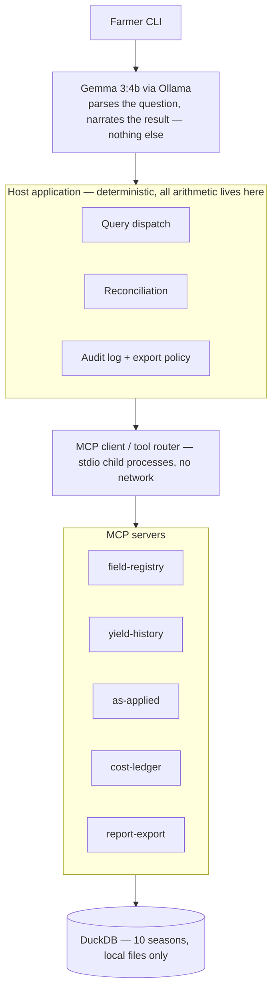

# Precision Farm MCP

A local-first, offline agricultural decision-support tool for one farmer's
laptop. It answers retrospective questions about a farm's own ten-season
record — *"which fields made money"*, *"was the north eighty a bad field or
a bad year"* — using an MCP (Model Context Protocol) architecture adapted
from [precision-medicine-mcp](https://github.com/lynnlangit/precision-medicine-mcp).

**v1 is retrospective arithmetic only.** No yield prediction, no crop
simulation, no prescriptive recommendations, no remote sensing. Those are
later phases; building toward them now would be speculative structure.

## Architecture



Gemma touches a question at exactly two points — turning it into a
validated query, and turning an already-computed result into plain
language. It never sees raw data, never holds a tool that could compute or
alter a number, and never resolves an ambiguous field name on its own. That
line is structural (the model layer has no import path to a database or MCP
client at all — see `model/tests/test_model_bounded.py`), not just a prompt
instruction.

## Quick start

```bash
# Generate ten seasons of synthetic (deliberately messy) farm data
uv run --project generator python -m farm_data_gen.cli --seed 42 --out data/synthetic

# Ask a question (requires a local Ollama with gemma3:4b pulled)
ollama pull gemma3:4b
uv run --project host farm-cli "was the north eighty a bad field or a bad year"
```

## Repository layout

| Path | What it is |
|---|---|
| `generator/` | Deterministic synthetic-data generator: 10 seasons, ~12 fields, every defect (naming drift, splits/merges, sensor calibration error, messy spreadsheets) deliberately injected and recorded in `ground_truth.json` |
| `core/` (`farm_core`) | Shared library: DuckDB ingestion, field-identity resolution, reconciliation, the profitability engine, audit log, governance |
| `servers/mcp-*` | Five FastMCP servers exposing `farm_core` as MCP tools (Pydantic I/O, `readOnlyHint`, structured refusals) |
| `host/` (`farm_host`) | The host application: MCP client/router (stdio), the CLI |
| `model/` (`farm_model`) | The bounded Gemma layer: question → query, result → narration, plus the verification that keeps it bounded |
| `docs/EVAL_QUESTIONS.md` | Ten independent evaluation questions, each verifiable against `ground_truth.json` |

## The three hard problems

1. **Field identity across ten years.** A field's name isn't a stable key —
   it drifts in the farmer's own spreadsheet, gets formally renamed, and
   stops meaning anything across a split or merge. `core/field_identity.py`
   resolves the real ten-year timeline from raw files alone, using acreage
   continuity (not string matching) as the signal — proven first, since
   it's the riskiest piece.
2. **Spreadsheet ingestion with human confirmation.** Every farmer's ledger
   is different. A column-mapping is proposed, confirmed once per header
   shape, and persisted for reuse — never guessed silently.
3. **Reconciliation.** Two independent paths exist to several figures
   (yield monitor vs. scale tickets, ledger cost vs. as-applied cost).
   Where they disagree is a feature, surfaced neutrally, never asserted as
   the farmer's records being wrong.

## Verification

77 tests across the four packages, plus the 10 evaluation questions,
all currently green:

```bash
for pkg in generator core host model; do (cd $pkg && uv run pytest -q); done
```

Notably: computed profit matches `ground_truth.json` for every field/season
not carrying a deliberate defect; every injected defect is detected by its
defect ID; no code path opens a non-loopback network connection
(`host/tests/test_no_network.py`); and narration is verified both
numerically grounded in its payload and non-contradictory of any
categorical verdict it's given, with a deterministic fallback if the model
can't manage either after a retry.

## License

Apache 2.0 — see [LICENSE](LICENSE).
