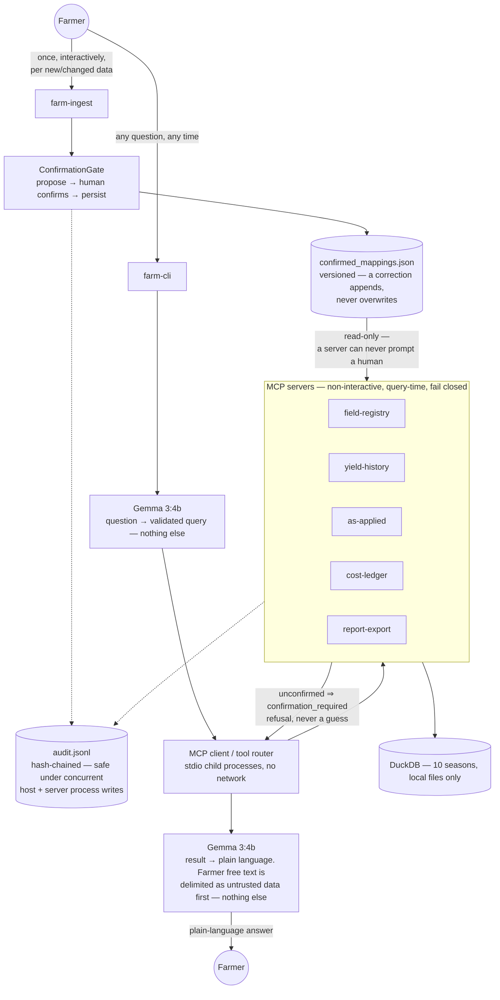

# Architecture

The technical design behind Precision Farm MCP. For the short,
farmer-facing picture, see the [README](../README.md#how-it-works).

Gemma touches a question at exactly two points — parsing it into a
validated query, and narrating a computed result. It never sees raw data,
computes a number, or resolves an ambiguous name itself; the model layer
can't import a database or MCP client (`model/tests/test_model_bounded.py`).

Confirmation is structural. A server can't prompt a human, so `farm-ingest`
confirms and persists every alias, event, and mapping once, with a human
present; servers read that record, refusing (`confirmation_required`)
rather than guessing. Every decision lands in one hash-chained,
concurrency-safe audit log. Ledger notes reaching Gemma are delimited as
untrusted, excluded from grounding, and never followed as instructions —
proven against an injected-prompt defect.

## See also

- [README](../README.md) — the simple picture, quick start, and repository layout
- [EVAL_QUESTIONS.md](EVAL_QUESTIONS.md) — ten independent evaluation questions
- [PHASE_PLAN_BCD.md](PHASE_PLAN_BCD.md) — the remaining roadmap
