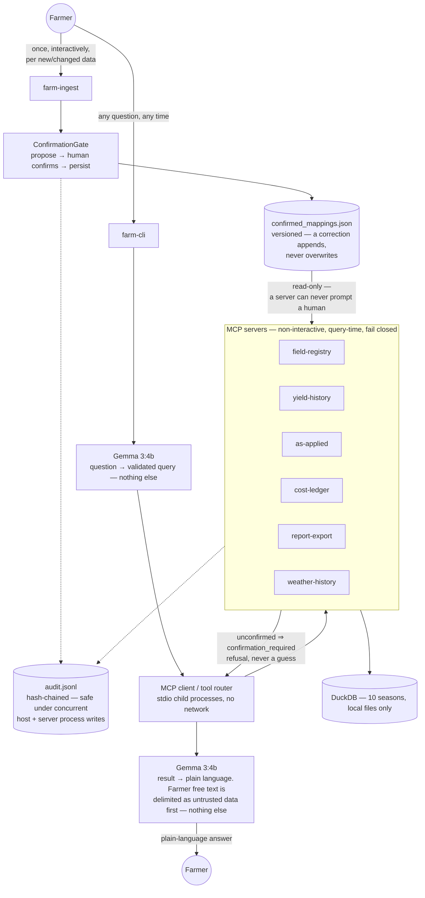

# Architecture

The technical design behind Precision Farm MCP. For the short,
farmer-facing picture, see the [README](../README.md#how-it-works).

Gemma touches a question at exactly two points — parsing it into a
validated query, and narrating a computed result. It never sees raw data,
computes a number, or resolves an ambiguous name itself; the model layer
can't import a database or MCP client (`model/tests/test_model_bounded.py`).

Confirmation is structural. A server can't prompt a human, so `farm-ingest`
confirms and persists every alias, event, and mapping once, with a human
present; servers read that record, refusing (`confirmation_required`)
rather than guessing. Every decision lands in one hash-chained,
concurrency-safe audit log. Ledger notes reaching Gemma are delimited as
untrusted, excluded from grounding, and never followed as instructions —
proven against an injected-prompt defect.

## Component status

| Component | Status | Note |
|---|---|---|
| Ingest/query confirmation split, `ConfirmationGate` | Built | |
| 5 MCP servers, `farm-cli`, `farm-ingest` | Built | |
| Hash-chained, concurrency-safe audit log | Built | Fixed in Phase A — the host process and every spawned server write to it |
| Provenance (`modeled` subtree), grounding split | Built | Populated by Phase C's weather/soil attribution on `bad_year` verdicts (`report-export.bad_field_or_bad_year`) — everywhere else it's still `null`, honestly, not a gap |
| Untrusted-text handling, payload capping | Built | |
| Governance metrics harness (`farm-metrics`) | Built | Phase B; gained an `attribution_backtest` section in Phase C |
| **Diverged:** confirmation resolved inline at query time | — | The original shape assumed a server could ask when unsure. Phase 0's audit found MCP servers are non-interactive stdio subprocesses that can never prompt a human, forcing the ingest/query split instead — a structural fix, not a config option |
| Weather ingestion, attribution model | Built | Phase C — synthetic daily weather + static soil AWC (`mcp-weather-history`), a *relative* expectation model (`core/expectation.py`) decomposing a shortfall into a weather-driven `season_effect` and an unexplained `residual`, and `QueryIntent.EXPLAIN_SHORTFALL` for "why" questions |
| Zone-level (sub-field) profitability | Deferred | Phase D |
| Remote sensing | Deferred | No phase yet — out of v1 scope by design |
| Agronomy reference data (cultivar calibration, etc.) | Deferred | `core/expectation.py` is deliberately a *relative* expectation model, which turned out not to need this after all |
| Prescriptive crop model / recommendations | Deferred | No phase yet — explicitly out of v1 scope (see the README) |
| Live weather / any sync boundary | Deferred | See known future tension below |

## Roadmap

| Deferred component | Needed by |
|---|---|
| Zone-level profitability | Phase D |
| Live weather / sync boundary | Not yet scheduled — see known future tension |
| Remote sensing | Not yet scheduled |
| Prescriptive crop model | Not yet scheduled |
| Agronomy reference data | Not yet scheduled — only if an absolute (not relative) expectation model is ever required |

## Known future tensions

**Weather is synthetic, on purpose.** With real weather the true
decomposition of a shortfall is unknowable, so an attribution claim would
be unfalsifiable; with generated weather it's known exactly, because the
generator caused it — verified directly by forcing one season's weather
into a real drought and confirming `core/expectation.py`'s attribution
correctly assigns it to weather, not management (`core/tests/
test_expectation.py`). Synthetic weather also means Phase C added zero new
attack surface to `host/tests/test_no_network.py`'s guarantee.

Live weather, if ever added, would need a sync boundary and would weaken
"no outbound network" to "no network at query time" — a real, deliberate
future divergence from the current all-local design. That trade-off is
recorded here now, deliberately, rather than discovered later:
**`test_no_network.py` is not weakened in this build**, and any future
change that touches it should update this section first.

## See also

- [README](../README.md) — the simple picture, quick start, and repository layout
- [EVAL_QUESTIONS.md](EVAL_QUESTIONS.md) — ten independent evaluation questions
- [PHASE_PLAN_BCD.md](PHASE_PLAN_BCD.md) — the remaining roadmap
