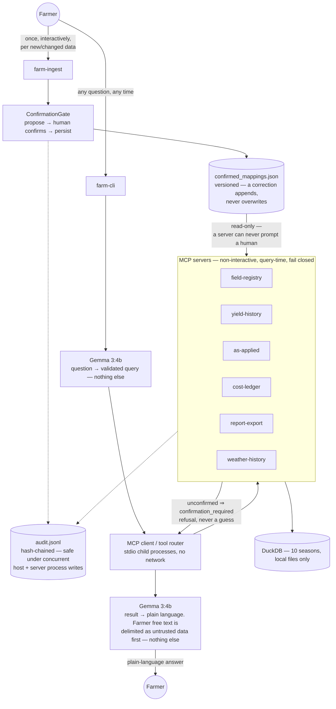

# Architecture

The technical design behind Precision Farm MCP. For the short,
farmer-facing picture, see the [README](../README.md#how-it-works).

Gemma touches a question at exactly two points — parsing it into a
validated query, and narrating a computed result. It never sees raw data,
computes a number, or resolves an ambiguous name itself; the model layer
can't import a database or MCP client (`model/tests/test_model_bounded.py`).

Confirmation is structural. A server can't prompt a human, so `farm-ingest`
confirms and persists every alias, event, and mapping once, with a human
present; servers read that record, refusing (`confirmation_required`)
rather than guessing. Every decision lands in one hash-chained,
concurrency-safe audit log. Ledger notes reaching Gemma are delimited as
untrusted, excluded from grounding, and never followed as instructions —
proven against an injected-prompt defect.

## Component status

| Component | Status | Note |
|---|---|---|
| Ingest/query confirmation split, `ConfirmationGate` | Built | |
| 6 MCP servers, `farm-cli`, `farm-ingest` | Built | |
| Hash-chained, concurrency-safe audit log | Built | Fixed in Phase A — the host process and every spawned server write to it |
| Provenance (`modeled` subtree), grounding split | Built | Populated by Phase C's weather/soil attribution on `bad_year` verdicts (`report-export.bad_field_or_bad_year`) — everywhere else it's still `null`, honestly, not a gap |
| Untrusted-text handling, payload capping | Built | |
| Governance metrics harness (`farm-metrics`) | Built | Phase B; gained an `attribution_backtest` section in Phase C |
| **Diverged:** confirmation resolved inline at query time | — | The original shape assumed a server could ask when unsure. Phase 0's audit found MCP servers are non-interactive stdio subprocesses that can never prompt a human, forcing the ingest/query split instead — a structural fix, not a config option |
| Weather ingestion, attribution model | Built | Phase C — synthetic daily weather + static soil AWC (`mcp-weather-history`), a *relative* expectation model (`core/expectation.py`) decomposing a shortfall into a weather-driven `season_effect` and an unexplained `residual`, and `QueryIntent.EXPLAIN_SHORTFALL` for "why" questions |
| Zone-level (sub-field) profitability | Built | Phase D — `core/zone_profitability.py` grids each field into a 2x2 set of zones and computes per-zone profit for the seasons with as-applied coverage; `report-export.zone_profitability` (per field) and `.unprofitable_zones_in_profitable_fields` (farm-wide headline figure) |
| CI (`.github/workflows/tests.yml`) | Built | Split by design: `generator`+`core` (no Ollama dependency) run on both `ubuntu-latest` and `windows-latest` — this is what backs the Windows-tested claim in `docs/FARMER_GUIDE.md`. `host`+`model` (real, unmocked Ollama calls, same convention as their own test suites) run on `ubuntu-latest` only; driving an unattended Ollama install on a Windows runner is untested from this environment, so it isn't claimed |
| Readiness check (`farm-preflight`) | Built | Checks `uv`, Ollama reachability, the model being pulled, synthetic data, and `farm-ingest` having run, then a live end-to-end query — one command instead of five separately confusing failures |
| Non-interactive ingest (`farm-ingest --auto-approve-synthetic-only`) | Built | Reuses the existing `confirm.auto_approve` (no new confirm function), structurally refused outside `data/synthetic/` — DEF-ALIASTIE is the proof that auto-approval gives a confidently wrong answer on real data, so this must never reach a farmer's own records; `core/tests/test_confirmation_gate.py` allowlists exactly this one reference and fails on any other |
| Model-unreachable vs. out-of-scope distinction (`ParseFailure.kind`) | Built | `query_parser.py` classifies a dead Ollama or unpulled model separately from a genuinely out-of-scope question; `farm-cli` gives each a different, correctly-targeted message. `narrator.py`'s two `ollama.chat` calls are guarded the same way, falling back to the deterministic template rather than raising |
| Non-zero exit codes (`farm-cli`, `farm-ingest`) | Built | `answer_question` returns an `AnswerResult(text, ok)`; `main()` exits 1 on any refusal (parse failure, tool refusal) or `ConfirmationRejected`/`SyntheticDataRequired`, not just 0 always |
| Deterministic "therefore" line (`host/src/farm_host/therefore.py`) | Built | One template-built sentence appended after a successful answer, keyed on payload shape (`verdict`, `zones`, the farm-wide summary, or a ranking) — never model-generated, and omitted (not invented) for shapes with no verdict to restate (reconciliations, `resolve_field_name`, `no_data`) |
| Model-free query path (`farm-cli --intent`) | Built | Bypasses `parse_question` and `narrate_verified` entirely — no `ollama.chat` call anywhere in this path (`test_structured_path_never_calls_ollama`) — reusing the same `_INTENT_TO_SERVER`/`_INTENT_TO_TOOL`/`_tool_args` routing as the natural-language path; `--list-intents` prints every intent and its required flags from `query_schema.REQUIRED_FIELDS` |
| **Diverged:** zone cost is field-uniform, not spatially resolved | — | The Phase D spec called for joining yield points to as-applied events spatially. Checked against the actual generated data: `as_applied_events` has exactly 5 rows per field/season (one per product), each a single decorative lat/lon with an already field-wide rate — nothing to join per zone. Cost genuinely has no spatial resolution in this data model (ledger rows are `cost_basis: "per_acre"`, uniform by construction), so zone cost reuses the field's own authoritative `total_cost/acres` uniformly; only yield is actually zone-resolved, from `yield_monitor_points`' hundreds of real per-point readings |
| Remote sensing | Deferred | No phase yet — out of v1 scope by design |
| Agronomy reference data (cultivar calibration, etc.) | Deferred | `core/expectation.py` is deliberately a *relative* expectation model, which turned out not to need this after all |
| Prescriptive crop model / recommendations | Deferred | No phase yet — explicitly out of v1 scope (see the README) |
| Live weather / any sync boundary | Deferred | See known future tension below |

## Roadmap

| Deferred component | Needed by |
|---|---|
| Live weather / sync boundary | Not yet scheduled — see known future tension |
| Remote sensing | Not yet scheduled |
| Prescriptive crop model | Not yet scheduled |
| Agronomy reference data | Not yet scheduled — only if an absolute (not relative) expectation model is ever required |

## Known future tensions

**Weather is synthetic, on purpose.** With real weather the true
decomposition of a shortfall is unknowable, so an attribution claim would
be unfalsifiable; with generated weather it's known exactly, because the
generator caused it — verified directly by forcing one season's weather
into a real drought and confirming `core/expectation.py`'s attribution
correctly assigns it to weather, not management (`core/tests/
test_expectation.py`). Synthetic weather also means Phase C added zero new
attack surface to `host/tests/test_no_network.py`'s guarantee.

Live weather, if ever added, would need a sync boundary and would weaken
"no outbound network" to "no network at query time" — a real, deliberate
future divergence from the current all-local design. That trade-off is
recorded here now, deliberately, rather than discovered later:
**`test_no_network.py` is not weakened in this build**, and any future
change that touches it should update this section first.

## See also

- [README](../README.md) — the simple picture, quick start, and repository layout
- [FARMER_GUIDE.md](FARMER_GUIDE.md) — plain-language setup and usage guide
- [EVAL_QUESTIONS.md](EVAL_QUESTIONS.md) — eleven independent evaluation questions
- [PHASE_PLAN_BCD.md](PHASE_PLAN_BCD.md) — the phase history and roadmap
